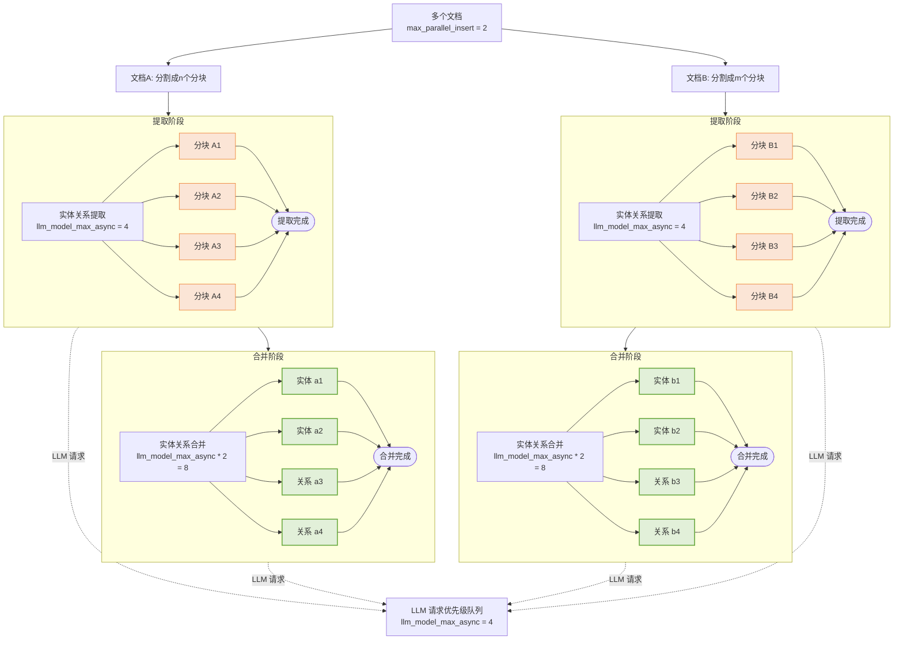

## LightRAG 多文档处理：并发控制策略详解

LightRAG 在处理多个文档时采用多层并发控制策略。本文深入分析文档层级、分块层级和 LLM 请求层级的并发控制机制，帮助你理解为什么会出现特定的并发行为。

### 1. 文档级并发控制

**控制参数**: `max_parallel_insert`

该参数控制同时处理的文档数量。目的是防止过度并行导致系统资源被淹没，从而延长单个文件的处理时间。文档级并发由 LightRAG 中的 `max_parallel_insert` 属性控制，默认值为 2，可通过 `MAX_PARALLEL_INSERT` 环境变量配置。建议 `max_parallel_insert` 设置在 2 到 10 之间，通常为 `llm_model_max_async/3`。设置过高会增加合并阶段不同文档间实体和关系命名冲突的可能性，从而降低整体效率。

### 2. 分块级并发控制

**控制参数**: `llm_model_max_async`

该参数控制文档内提取阶段同时处理的分块数量。目的是防止大量并发请求垄断 LLM 处理资源，阻碍多个文件的高效并行处理。分块级并发由 LightRAG 中的 `llm_model_max_async` 属性控制，默认值为 4，可通过 `MAX_ASYNC` 环境变量配置。该参数的目的是在处理单个文档时充分利用 LLM 的并发能力。

在 `extract_entities` 函数中，**每个文档都独立创建**自己的分块信号量。由于每个文档独立创建分块信号量，系统的理论分块并发为：

$$
分块并发 = 最大并行插入数 × LLM模型最大异步数
$$

例如：
- `max_parallel_insert = 2`（同时处理 2 个文档）
- `llm_model_max_async = 4`（每个文档最多 4 个分块并发）
- 理论分块级并发：2 × 4 = 8

### 3. 图级并发控制

**控制参数**: `llm_model_max_async * 2`

该参数控制文档内合并阶段同时处理的实体和关系数量。目的是防止大量并发请求垄断 LLM 处理资源，阻碍多个文件的高效并行处理。图级并发由 LightRAG 中的 `llm_model_max_async` 属性控制，默认值为 4，可通过 `MAX_ASYNC` 环境变量配置。图级并行控制参数同样适用于文档删除后实体关系重建阶段的并行管理。

由于实体关系合并阶段并非每个操作都需要 LLM 交互，其并行度设置为 LLM 并行度的两倍。这样既优化了机器利用率，又防止了对 LLM 资源的过度队列竞争。

### 4. LLM 级并发控制

**控制参数**: `llm_model_max_async`

该参数管理整个 LightRAG 系统发送的 **LLM 请求的并发数量**，包括文档提取阶段、合并阶段和用户查询处理。

LLM 请求优先级由全局优先队列管理，该队列**系统地优先处理用户查询**，其次是合并相关请求，最后是提取相关请求。这种策略优先级**最小化用户查询延迟**。

LLM 级并发由 LightRAG 中的 `llm_model_max_async` 属性控制，默认值为 4，可通过 `MAX_ASYNC` 环境变量配置。

### 5. 完整并发层级图



> 提取和合并阶段共享一个全局优先级 LLM 队列，由 `llm_model_max_async` 控制。虽然许多实体和关系的提取与合并操作可能处于"积极处理"状态，**但只有有限数量的操作会并发执行 LLM 请求**，其余的将被排队等待轮次。

### 6. 性能优化建议

* **根据 LLM 服务器或 API 提供商的能力增加 LLM 并发设置**

在文件处理阶段，LLM 的性能和并发能力是关键瓶颈。在本地部署 LLM 时，服务的并发容量必须充分考虑 LightRAG 的上下文长度需求。LightRAG 建议 LLM 支持最少 32KB 的上下文长度；因此，服务器并发应基于此基准计算。对于 API 提供商，如果客户端请求因并发请求限制被拒绝，LightRAG 会重试请求最多三次。可通过后端日志确定是否发生了 LLM 重试，从而判断 `MAX_ASYNC` 是否超过了 API 提供商的限制。

* **将并行文档插入设置与 LLM 并发配置对齐**

建议的并行文档处理任务数为 LLM 并发数的 1/4，最少 2 个，最多 10 个。设置更高的并行文档处理任务数通常不会加快整体文档处理速度，因为即使只有少数几个并发处理的文档也能充分利用 LLM 的并行处理能力。过度的并行文档处理会显著增加每个单独文档的处理时间。由于 LightRAG 以文件为单位提交处理结果，大量并发文件会需要缓存大量数据。如果系统出错，所有中间阶段的文档都需要重新处理，从而增加错误处理成本。例如，当 `MAX_ASYNC` 配置为 12 时，将 `MAX_PARALLEL_INSERT` 设置为 3 是合适的。

### 参数速查表

| 参数 | 默认值 | 环境变量 | 说明 | 推荐范围 |
|------|--------|---------|------|---------|
| `max_parallel_insert` | 2 | `MAX_PARALLEL_INSERT` | 同时处理的文档数 | 2-10 |
| `llm_model_max_async` | 4 | `MAX_ASYNC` | LLM 最大并发请求数 | 4-16 |
| 图级并发 | - | - | 图合并阶段并发数 | `llm_model_max_async * 2` |

### 实际配置示例

**场景 1：小规模本地部署（资源有限）**
```bash
MAX_ASYNC=2
MAX_PARALLEL_INSERT=1
```
- 仅处理 1 个文档，分块并发限制为 2
- 适合 CPU/内存资源受限的环境

**场景 2：中等规模云部署**
```bash
MAX_ASYNC=8
MAX_PARALLEL_INSERT=2
```
- 同时处理 2 个文档，每个文档最多 8 个分块并发
- 理论分块并发：2 × 8 = 16
- 适合中等规模的文档处理工作负载

**场景 3：高性能服务器部署**
```bash
MAX_ASYNC=16
MAX_PARALLEL_INSERT=4
```
- 同时处理 4 个文档，每个文档最多 16 个分块并发
- 理论分块并发：4 × 16 = 64
- 适合高并发生产环境

### 常见问题

**Q: 为什么增加 `MAX_PARALLEL_INSERT` 没有加快处理速度？**

A: 这是因为 LLM 的并发能力是瓶颈。即使只有 2 个并发文档，也能充分利用 LLM 的并发容量。增加文档数只会：
1. 增加每个文档的处理时间（资源竞争）
2. 增加错误处理成本（需要缓存更多数据）

**Q: 什么时候应该增加 `MAX_ASYNC`？**

A: 当你观察到以下现象时：
1. LLM 服务器或 API 有空闲容量
2. 后端日志中没有出现 "rate limit" 或 "timeout" 错误
3. LLM 回复时间较短（< 5 秒）

**Q: 查询速度比较慢，如何优化？**

A: 由于查询在优先级队列中优先级最高，应检查：
1. 是否有大量文档正在处理中（减少 `MAX_PARALLEL_INSERT`）
2. 是否 LLM 本身响应慢（增加 `MAX_ASYNC` 需谨慎）
3. 是否向量检索返回的文本过多（优化提示词）
